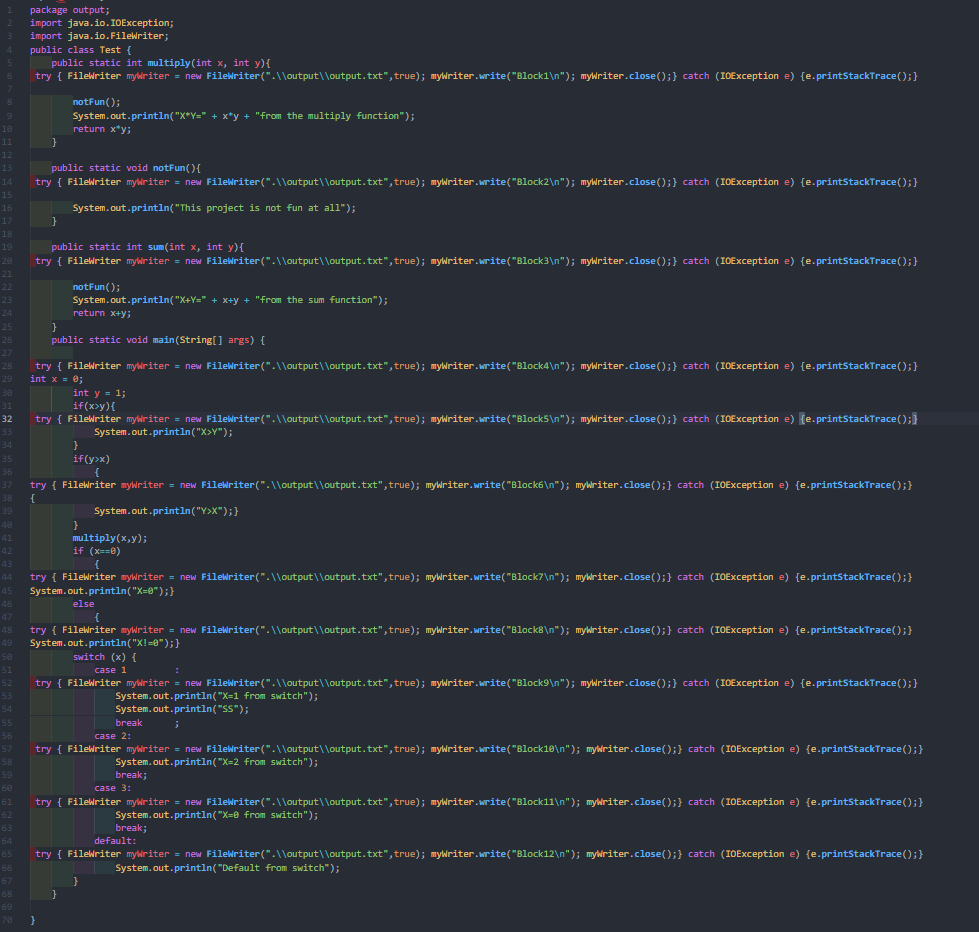

# Java-Line-Execution-Detector
This Project uses ANTLR java parser to detect the line blocks which was executed from an input java program.

## Members:
  1. Ahmed Nasser Ahmed
  2. Ahmed Hesham Salah
  3. Ahmed Younes Ibrahim
  4. Mohamed Adel Mahmoud

## Week 1:

  * Use ANTLR Java grammar.
  * Test the grammar on a simple Java program to show the parse tree.
  * Show the starting rule of the grammar (compilationUnit).
    * As an example input file we used this simple java program
      
    * The parse tree of that sample java program would be:
      

## Week 2:

  * Write a Java program based on ANTLR that takes a java file as an input and outputs a modified intermediate Java file (injected code).
  * Run the modified intermediate generated Java file to show which blocks of the code are Entered..
    * As an example for a Java input file, we used this:
   
      
    * We ran the code and the result is in the console as shown.
      
## Week 3: 

  * Use the output from Week 2 to generate an HTML with highlighted red/green lines for Entered/UnEntered blocks.
  * Full documentation using doxygen for the classes and functions developed only.
  * Make sure that the pipeline does not include any manual effort. 
  * Show at least 3 Java examples that shows difficult scenarios.
    1. * For the first Example:
   
      
    * Then all the required files are generated automatically with a simple run of "Injector" driver code (in the main method)
       * The generated Output.java file:  
        
       * The generated HTML file:
        
    2. * For the Second Examble:
 
      
       * The generated Output.java file:  
        
       * The generated HTML file:
        
    3. * For the third Examble:
  
      
       * The generated Output.java file:  
        
       * The generated HTML file:
        
